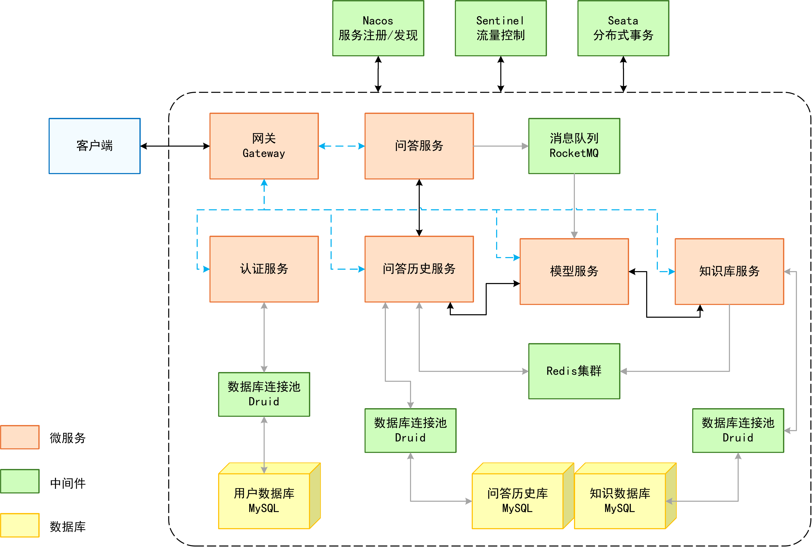

# 技术方案
## 针对基于大语言模型的AI客服系统

### 整体框架
  

### 整体设计思路
本系统采用分层架构设计，旨在通过讯飞星火API提供智能化、高可用的客户服务 解决方案。核心设计思路是通过微服务架构实现业务解耦，
利用分布式中间件保障系统高可用性和扩展性。前端用户请求经API网关统一接入，通过认证服务鉴权后，由问答服务作为消息队列生产者，发送用户问题，
模型服务作为消费者消费，并将后续任务（如协调知识库与问答历史服务、调用大模型API）通过线程池分配的线程实现并发处理。
同时记录问答历史。系统设计充分考虑了高并发场景，引入Redis缓存、消息队列和线程池优化性能，通过Sentinel实现流量控制保障
系统稳定性。

系统设计主要遵循以下原则：
* 服务解耦：将系统划分为六个独立微服务，各服务专注于单一职责
* 异步通信：使用RocketMQ实现服务间异步通信，避免阻塞式调用
* 分布式事务：通过Seata保证核心业务（如问答-知识库更新）的数据一致性
* 弹性扩展：基于Nacos实现服务动态伸缩，应对流量高峰
* 分级缓存：采用Redis多级缓存策略（知识库缓存、会话缓存等）提升响应速度
* 流量控制：通过Sentinel实现熔断和限流，保护后端服务

### 数据库设计
#### 一、用户数据库 (user_db)
#### user 表设计

|字段名	|数据类型	|约束条件	|注释|
|  ----     |-----|   ----    |   ----      |
|id	|BIGINT|	PRIMARY KEY, AUTO_INCREMENT	|用户ID（主键）|
|username	|VARCHAR(255)|	NOT NULL, UNIQUE	|用户名|
|password	|VARCHAR(255)|	NOT NULL	|加密密码|
|email	|VARCHAR(255)|	NOT NULL, UNIQUE	|邮箱|
|phone	|VARCHAR(255)|		|手机号|
|created_at	|DATETIME|	DEFAULT CURRENT_TIMESTAMP	|创建时间|
|last_login|	DATETIME|		|最后登录时间|
|status	|TINYINT	|DEFAULT 1|	状态(0禁用,1启用)|
|role	|TINYINT|	DEFAULT 1|	权限(0管理员,1用户)|

### 二、会话管理数据库 (session_db)
#### session 表

|字段名	|数据类型	| 约束条件	     |注释|
|  ----     |-----|-----------|   ----      |
|id	|VARCHAR(255)	|PRIMARY KEY	|会话ID(UUID)|
|user_id|	BIGINT	|NOT NULL	|用户ID|
|title	|VARCHAR(255)	|NOT NULL	|会话标题（首条问题）|
|created_at	|DATETIME	DEFAULT CURRENT_TIMESTAMP	|创建时间|
|last_activity	|DATETIME		|最后活动时间|
|status	|TINYINT	| DEFAULT 1 |	状态(0关闭,1活跃)|

外键约束： 
user_id REFERENCES user_db.user(id) 

#### qa_pair 表

|字段名	|数据类型	|约束条件|	注释|
|  ----     |-----|   ----    |   ----      |
|id	|BIGINT	|PRIMARY KEY, AUTO_INCREMENT|	问答ID|
|session_id|	VARCHAR(255)|	NOT NULL|	会话ID|
|question|	TEXT|	NOT NULL	|用户问题|
|answer	|LONGTEXT|		|AI回复|
|ask_time	|DATETIME(3)|	NOT NULL	|提问时间（毫秒精度）|
|answer_time	|DATETIME(3)	|	|回复时间（毫秒精度）|
|response_duration	|INT|		|响应耗时(ms)|

外键约束： 
session_id REFERENCES session_db.session(id) 

#### session_access_log 表

|字段名|	数据类型	|约束条件|	注释|
|  ----     |-----|   ----    |   ----      |
|id	|BIGINT	|PRIMARY KEY, AUTO_INCREMENT	|日志ID|
|session_id	|VARCHAR(36)	|NOT NULL	|会话ID|
|user_id	|BIGINT	|NOT NULL	|用户ID|
|access_time	|DATETIME	|DEFAULT CURRENT_TIMESTAMP	|访问时间|
|operation	|VARCHAR(20)	|	|操作类型(create,read,delete)|

外键约束： 
session_id REFERENCES session_db.session(id) 
user_id REFERENCES user_db.user(id) 

### 三、知识库数据库 (knowledge_db)
#### knowledge 表

| 字段名	          |数据类型	| 约束条件                      | 	注释   |
|---------------|-----|---------------------------|-------|
| id	           |BIGINT| 	PRIMARY KEY, AUTO_INCREMENT | 	知识ID |
| question      |	TEXT| 	                         | 问题|
| answer	       |LONGTEXT	|                           | 解答    |
| created_at    |	DATETIME| 	DEFAULT CURRENT_TIMESTAMP | 	创建时间 |
| last_activity |	DATETIME| 	|	最后活动时间                    |

### 四、索引设计说明
1. 全文索引 (用于知识库检索)
> ALTER TABLE `qa_pair` ADD FULLTEXT INDEX `idx_question` (`question`);

作用：
* 为qa_pair表的question字段创建全文索引
* 优化场景：当用户查询历史对话中的特定问题时，可快速检索相关记录
* 性能提升：相比LIKE查询，搜索速度提高

2. 普通索引 (用于会话管理)
> ALTER TABLE `session` ADD INDEX `idx_last_activity` (`last_activity`);

作用：
* 为session表的last_activity字段创建普通索引
* 优化按最后活动时间的排序和筛选操作
* 显著提升查询效率：从O(n)优化到O(log n)

### 五、分布式事务支持：undo_log表
每个业务数据库都包含一个undo_log表，用于支持分布式事务回滚：

|字段名	|数据类型|	注释|
|  ----     |-----|   ----    |
|id	|BIGINT	|主键ID|
|branch_id|	BIGINT	|分支事务ID|
|xid	|VARCHAR(100)	|全局事务唯一标识|
|context	|VARCHAR(128)	|上下文|
|rollback_info	|LONGBLOB	|回滚信息|
|log_status	|INT	|状态(0正常,1全局已完成)|
|log_created	|DATETIME	|创建时间|
|log_modified	|DATETIME|	修改时间|

关键作用： 
* 事务回滚保障：存储事务前的数据状态，用于失败时回滚
* 分布式事务协调：Seata等框架通过此表实现全局事务一致性
* 事务日志追踪：完整记录事务生命周期

工作流程： 
* 事务开始时记录undo_log
* 所有分支事务提交后标记全局完成
* 任一失败则根据rollback_info回滚
* 清理已完成的undo_log记录

### 技术路线与功能模块

#### 技术栈

|  组件    | 技术实现                  |   版本             |   作用             |
|  ----     |-----------------------|   ----             |   ----             |
|微服务框架	| Spring Cloud Alibaba|	3.1.8 | 服务治理            |
|服务注册/配置| 	Nacos	|      2.4.3         | 服务发现与配置管理    |
|流量控制	| Sentinel	 |   1.8.8    | 服务熔断与限流       |
|分布式事务	| Seata	     |  2.1.0   | 保证数据一致性       |
|缓存	| Redis	           |  3.0.504 | 快速响应、问答缓存|
|消息队列	| RocketMQ	      | 5.3.2   | 服务解耦、异步处理
|数据库	|MySQL + Druid连接池|-| 持久化存储         |        
|API网关	|Spring Cloud Gateway|-| 请求路由与过滤   |            
|前端框架	| thymeleaf	  |   -    | 用户交互界面|

#### 服务模块实现
**网关服务模块：** 
* 通过Nacos实现负载均衡的路由规则。
* 限流控制(Sentinel)

**认证服务模块：** 
* 前端集成到了这个模块，包括登录注册、对话页面
* 基于JWT实现无状态认证
* 数据库存储用户凭证（密码加密存储）
* 为其他服务提供统一鉴权接口

**问答服务模块和模型服务模块：** 
**思路：** 
我认为，问答服务和模型服务之间做解耦是有必要的。 
首先用户请求是不可控的，可能在短时间内数量暴增。
由于大语言模型的回答缓慢，一次回答针对单个用户是原子操作。
所以请求会大量积压在前期流程，造成前期和后期速度存在差异。 
将问答服务和模型服务解耦，问答服务处理简单逻辑（如缓存查询）保持毫秒级响应，
模型服务专注大模型交互，容忍较高延迟。 
若发现用户请求数暴增，可以暂时多开一些模型服务，通过服务解耦解决用户请求-大模型响应速度的矛盾，就如计算机通过存储层级解决CPU-内存速度差异。  
**功能实现：** 
* 讯飞星火API对接：实现流式响应处理，与前端建立SSE连接
* 消息队列：RocketMQ顺序消费保障问答顺序，并且作为服务解耦的桥梁
* 连接管理：维护SSE连接映射表（clientId -> connection）

**问答历史服务模块和知识库服务模块：** 
**思路：** 
将数据存取与数据处理解耦是这两个模块的重要目的。问答服务模块和模型服务模块专注于消息传递与大模型调用，
问答历史服务模块和知识库服务模块专注于数据存储。
同时，两个服务模块都采用了Redis作为分布式缓存，通过布隆过滤器防止缓存穿透。 

**功能实现：** 
* 缓存策略：布隆过滤器防穿透
* 查询优化：利用索引优化了查询
* 数据管理：针对数据库的增删改查

### 关键问题与解决方案
### 问题1：SSE连接与消息服务路由不一致
#### 问题描述：
在多个模型服务实例运行时，由于负载均衡机制，前端建立的SSE连接与处理消息队列的模型服务实例可能不一致。
当问答服务发送消息到RocketMQ后，消费者可能不是拥有对应SSE连接的实例，导致无法推送结果到前端。
#### 解决方案：
采用"广播+连接验证"机制确保消息正确处理，Redis维护全局连接映射表。

### 问题2：高并发下服务性能瓶颈
#### 问题描述：
压测中发现当高并发请求时，问答服务出现大量500错误。我认为根本原因是：
* 同步调用导致线程阻塞
* 数据库连接耗尽
* 消息堆积导致处理延迟

#### 解决方案：
线程池+异步处理+缓存优化。

### 系统总结
我设计的AI客服系统采用Spring Cloud Alibaba微服务架构，集成Nacos、Sentinel等中间件实现高可用分布式系统。 
**创新点在于：**
1) 通过"广播+连接验证"解决SSE连接与消息服务路由一致性问题；
2) 利用缓存和线程池优化实现高并发处理能力；
3) 设计前端请求锁机制保障流式响应顺序正确。
系统支持高并发的稳定运行，可通过微服务扩展支持大量用户访问。

# 实践进展
## 第一天
### 完成情况
使用微服务完成整体框架搭建 
微服务中间件采用Nacos注册中心/配置中心、Sentinel和Seata分布式事务 
将项目暂时分为了四个服务：”认证服务“-”问答服务“-”模型服务“-”系统服务“ 
完成了”认证服务“部分的登录注册，能够正常存入数据库 
通过API成功测试”问答服务“，及其对应的数据库存储情况 
通过API成功测试”模型服务“，不过还没有做大语言模型的调用 
当前使用了Redis、druid数据库连接池、RocketMQ消息队列等中间件 

### 问题汇总
2025/7/19 16:20 
当前遇到的问题： 
1. 消息队列一直报错the broker's disk is full [CL:  0.95 CQ:  0.95 INDEX:  0.95], messages are put to the slave, message store has been shut down
2. 前端和后端建立SSE通信暂时因为消息队列的问题无法进行

2025/7/19 16:38 
上述第一个问题解决了，配置文件中将存储路径重定位到D盘 

## 第二天
### 完成情况
将项目暂时又分为了六个服务：”网关服务“-”认证服务“-”问答服务“-”模型服务“-”知识库服务“-”问答历史服务“ 
继昨天完成的功能，今天又完成了以下内容： 
1. 解决了昨天的消息队列问题，问答服务作为生产者，模型服务作为消费者，当模型服务开始消费时，利用线程池为后续任务分配线程。
2. 完善了前端交互，用户可正常在界面切换多轮对话，并新建对话
3. 建立了与讯飞星火AI大模型的交互，采用流式传输
4. 建立知识库数据库，及其对应的增删改查
5. 调用大模型API之前，远程调用知识库服务，其会先去Redis中查询有无此知识，若没有则继续查询数据库；若知识库没有相关知识，则询问大模型，得到的答复通过远程调用知识库服务分别存储到Redis以及数据库中。

### 今晚和明天任务
1. 完成问答管理和知识库管理页面（管理员权限）
2. 开始准备压测相关API，撰写完整的压测报告以及设计方案（前期觉得可能后期会有所改动，而且时间紧迫，所以没马上画图和写报告，只是有一个初步的构思）
3. 完善登录安全问题

### 问题汇总
2025/7/20 
今天遇到的问题： 
1. 今天后端没有太大难题，主要难点在制作前端

2025/7/20 19:00 
遇到的问题： 
1. 流式传输的流式响应部分，采用的响应式编程导致上下文切换，使FeignClient找不到上下文了，这里我一直以为是OpenFeign的问题，但相同FeignClient的另一个方法都能调用成功。最后用异步调用的方式解决了这个问题。

## 第三天
### 完成情况
项目最终分为了六个服务：”网关服务“-”认证服务“-”问答服务“-”模型服务“-”知识库服务“-”问答历史服务“ 
继昨天完成的功能，今天又完成了以下内容： 
1. 增加知识库和问答历史界面
2. 解耦数据存储服务与数据计算服务，使“模型服务”专注于调用大语言模型的调用以及与前端的SSE通信
3. 测试各个模块以及整个流程
4. 针对“问答模块”的消息队列生产者部分，利用线程池优化