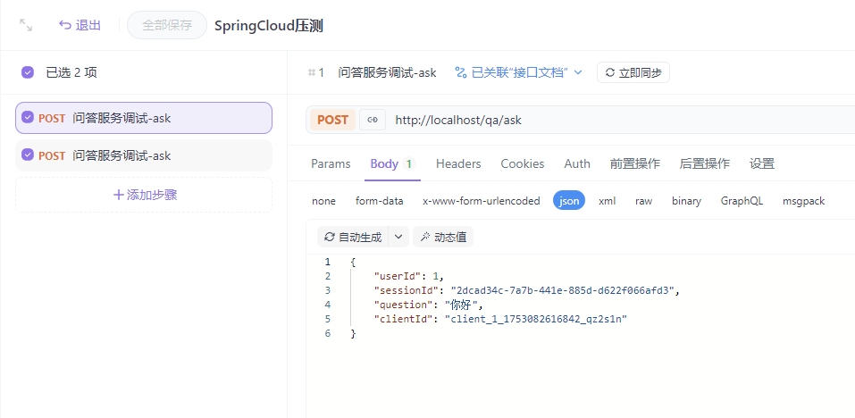
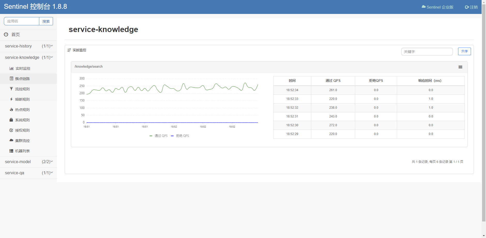
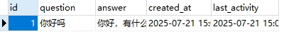
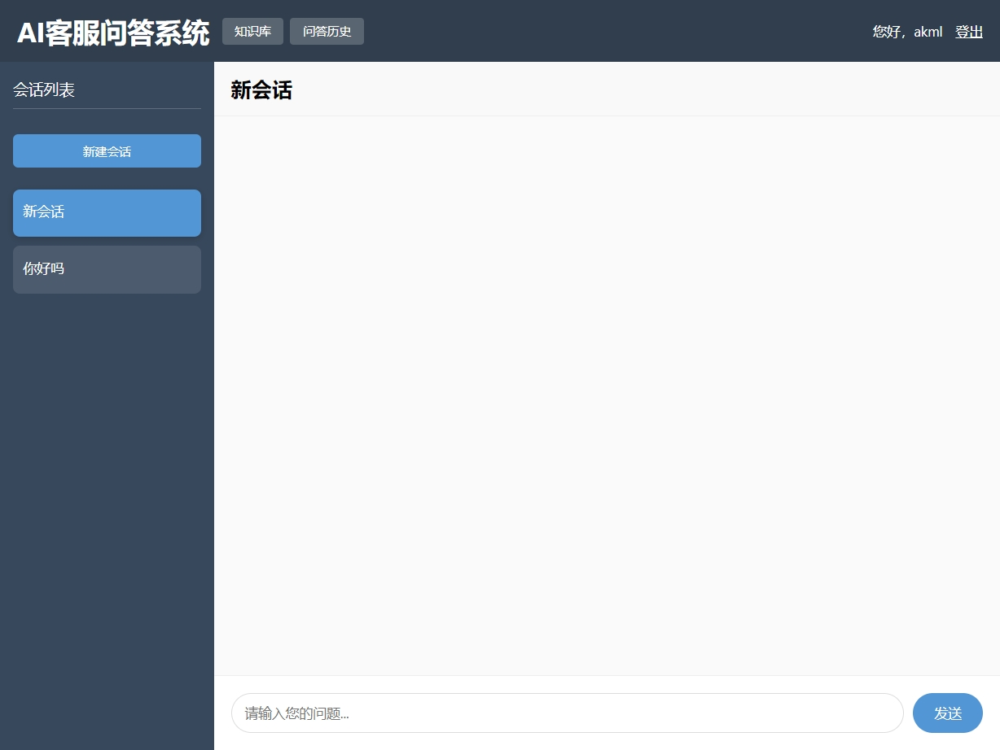

# 测试报告
## 压力测试
### 一、整体链路压测
本次压测主要针对问答服务全链路进行性能评估，验证核心微服务在高并发场景下的稳定性。测试采用单用户模拟方式，通过JMeter工具对问答服务API进行压力测试，覆盖问答服务→消息队列→模型服务→大模型交互→历史服务/知识库服务→SSE返回完整链路。以下为本次测试开启服务，其中模型服务开启两个，其余服务各开启一个： 
 
#### 压测配置与执行
1. 测试工具：Apache JMeter 
2. 线程组配置： 
线程数：1（单用户模拟） 
Ramp-up时间：1秒 
循环次数：1000次 
请求间隔：固定定时器50毫秒 
3. 测试接口： 
主链路：POST /qa/ask（问答服务API） 
依赖服务： 
GET /knowledge/search（知识库服务） 
POST /history/answer（历史服务） 
4. 测试场景： 
模拟用户连续提问场景，通过SSE长连接接收响应。因SSE连接特性，采用单线程循环请求方式验证系统在持续负载下的稳定性。 
    
    
    
    
    

#### 关键性能指标
|压测指标	|测试结果	|健康阈值|
|  ---- |---|   ----             |
|总请求数	|2000次	|-|
|平均响应时间|	2毫秒	|<50毫秒|
|最小响应时间|	1毫秒|	-|
|最大响应时间	|152毫秒	|<500毫秒|
|异常率	|0.00%|	<1%|
|系统吞吐量	|15.9请求/秒|	-|
|知识库QPS	|16.0请求/秒|	-|
|历史服务QPS	|16.0请求/秒	|-|

#### 链路性能分析
* 问答服务API平均响应2毫秒，在2000次请求中保持0错误率 
* Sentinel监控显示所有依赖服务QPS稳定在15-16区间 
* RocketMQ消息消费及时，无消息堆积告警 

相关结果如下： 
 
 
 
 

### 二、单点压测
本次单点压测针对认证服务、问答历史服务和知识库服务进行性能评估，通过JMeter工具模拟高并发场景，验证核心微服务在极端负载下的稳定性。测试采用100线程并发，1秒内启动全部线程，循环执行2000次请求，覆盖服务核心接口。以下为压测结果与分析： 

|服务名称|请求方法|	协议  |	服务器IP|	路径	 |自动重定向	|跟随重定向	|使用KeepAlive|
|  ---- |---   |   ----  |   ----  |   ----  |   ----   |   ----    |   ----   |
|知识库服务	|GET|	http	|localhost	|/knowledge/search?q=你好吗	|是	|是	|是|
|认证服务|	POST|	http	|localhost|	/auth/login|	是|	是	|是|
|历史服务	|GET	|http	|localhost|	/history/find|	是	|是	|是|

 
 

### 实时性能监控（Sentinel）
#### 知识库服务（/knowledge/search）性能表现：

|时间	  |通过 QPS	|拒绝 QPS	 | 响应时间 (ms)|
|  ---- |---   |   ----  |   ----  |
|18:52:34|	261.0|	0.0|	 0.0|
|18:52:33|	220.0|	0.0	| 1.0|
|18:52:32|	238.0|	0.0|	 1.0|
|18:52:31|	243.0	|0.0|	 0.0|
|18:52:30|	272.0|	0.0	| 0.0|

#### 历史服务（/history/find）性能表现：

| 时间	      | 通过 QPS	 |拒绝 QPS	 | 响应时间 (ms) |
|----------|---------|   ----  |-----------|
| 18:52:56 | 	226.0  |	0.0| 	 1.0     |
| 18:52:55 | 	224.0  |	0.0	| 0.0       |
| 18:52:54 | 	240.0  |	0.0| 	 0.0     |
| 18:52:53 | 	221.0	 |0.0| 	 1.0     |
| 18:52:52 | 	241.0  |	0.0	| 0.0       |

### JMeter压测汇总报告

|Label	|样本	|平均值(ms)	|最小值(ms)|	最大值(ms)|	异常 %	|吞吐量(/sec)	|接收 KB/sec|
|  ---- |---   |   ----  |   ----  |   ----  |   ----   |   ----    |   ----   |
|知识库服务调试-search	|60706	|2|	0	|116|	0.00%	|235.8|	65.81|
|认证服务调试-login|	60608|	413|	105|	2987|	0.00%|	235.4|	8547.33|
|历史服务调试-find|	60607|	2|	1|	100|	0.00%|	235.5|	29.44|
|总体|	181921	|139|	0	|2987|	0.00%	|706.5	|8640.56|

#### 链路性能分析
* 稳定性表现： 
所有服务在持续高压下保持0错误率，Sentinel监控显示拒绝QPS始终为0 
* 响应效率： 
知识库服务平均响应2ms，99%请求<116ms 
历史服务平均响应2ms，99%请求<100ms 
认证服务平均响应413ms（含加密验证流程） 
* 吞吐能力： 
单服务吞吐量稳定在235请求/秒 
系统总吞吐量达706请求/秒 
* 资源效率： 
知识库服务接收流量65.81KB/s 
认证服务接收流量8547.33KB/s（含用户凭证数据） 

相关结果如下： 
 
 
 

## 操作流程测试
以下是整个流程截图 
 
 
 
 
 
 
 
 
 
 
 
 
 
 
 
 
 
 
 
 
 
